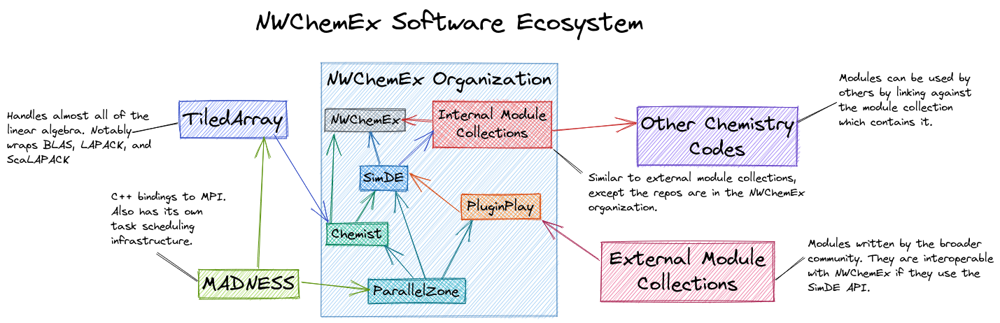

These concerns are not orthogonal (for example ease of use and varying levels of
programming expertise are related).

## Overall Software Ecosystem

The following figure serves as a brief introduction to how NWChemEx addresses
the aforementioned concerns as an organization, how the key pieces of the
NWChemEx design fit together, and how the NWChemEx organization fits into the
broader software ecosystem.

As a disclaimer, this figure is very coarse. A lot of the stack's complexity is
swept up into each of the boxes (particularly the "Internal Module Collections"
box, which includes pretty much every electronic structure method that NWChemEx
supports).

Performance key points:

1. Internal components of NWChemEx written in C++ to take advantage of the
   growing HPC support for C++ and to provide developers a performance focused
   coding language.
2. Performance is treated as a fundamental concern entering into the stack as
   part of the low level ParallelZone component.
3. ParallelZone acts as a sort of domain-specific language (DSL) for the rest of
   the NWChemEx stack, abstracting away much of the implementation details
4. Much of the actual scheduling, data movement, etc. is handled by the
   externally maintained MADNESS runtime and the libraries underlying it.

Linear algebra key points:

1. Linear algebra is the among the second lowest components of the stack,
   entering via Chemist.
2. Like ParallelZone, Chemist provides abstractions which allow the rest of the
   stack to express its linear algebra needs in a sort of DSL without worrying
   about the underlying details.
3. Efficient and performant linear algebra and tensor-related operations are
   provided by TiledArray.

Ease of use key points:

1. The tiered stack makes it easier to hide details.
2. The focus on DSLs at each layer lowers the barrier to entry as code looks
   more like what its modeling and less abstract.

Component mentality key points:

1. User facing APIs are written in Python to take advantage of its popularity in
   scientific software (particularly in workflows)
2. PluginPlay provides NWChemEx's abstractions for interacting with software
   components.
3. The bulk of NWChemEx's capabilities are provided by its internal module
   collection, which PluginPlay can run.
4. Other chemistry codes can link to any of our internal module collections and
   use any module in that collection.

Extensibility key points:

1. Developers outside the organization can write modules, which can then be
   immediately used with the NWChemEx software stack via PluginPlay.
2. Adding modules does not require modifying NWChemEx

Varying programmer expertise key points:

1. The focus on abstraction allows each layer to hide many of the technical
   details of the layer below it. These details are not lost, they are rolled up
   into opaque objects which get unrolled as they traverse the stack.
2. By time someone considers a layer like SimDE they are typically using objects
   like wavefunctions, molecules, and orbitals to express their computation
   rather than tensor ops or MPI calls.
