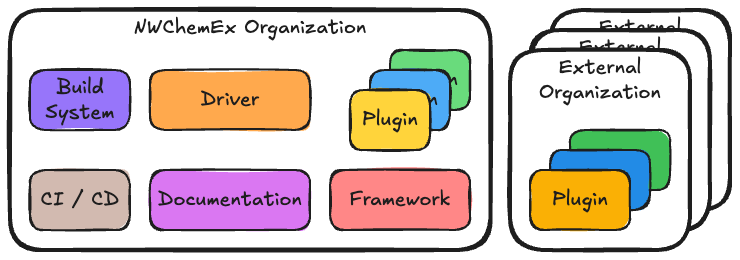

## What is a GitHub Organization?

A GitHub organization is a shared account where groups of people can 
collaborate across many projects at once. Owners and administrators can manage 
member access to the organization's data and projects with sophisticated 
security and administrative features. Organizations can also use GitHub's team 
management features to manage access to repositories, projects, and other 
resources.

## Why Do We Need an Organization?

We have decided to develop NWChemEx through GitHub in order to take advantage of
the collaboration and project management features provided by GitHub. At the
same time we know that NWChemEx will be a large-scale project, and we need a 
way to organize and manage the various repositories and contributors. GitHub 
organizations are GitHub's solution to these problems.

## Responsibilities

The NWChemEx organization is responsible for:

1. Maintaining the core software stack, including the framework, plugins, and
   driver.
2. Providing both developer and user-facing documentation.
3. Managing devops tools and infrastructure.

## Architecture

The NWChemEx organization contains a series of repositories, which in the above
schematic are labeled according to their purpose:

- The framework, known as the simulation development environment (SimDE), is
  the core of the NWChemEx software stack. It provides the infrastructure and
  APIs needed to develop modules that compute properties.

  - Main discussion: simde_architecture.

- The plugins are modules that compute properties. They depend on the framework 
  for the infrastructure and APIs needed to interface with the ecosystem.
  Plugins are developed and maintained independently of the framework. While
  some are developed by the NWChemEx team, we anticipate that many will be
  developed and hosted by external organizations.
- The NWChemEx driver is a repository that provides a single interface wrapping
  the framework and plugins. It provides a more traditional electronic structure
  interface and is intended to be the primary interface for end users of the 
  NWChemEx software stack.
- The documentation repository consolidates developer-facing documentation that
  is applicable to all repositories in the NWChemEx ecosystem into a single
  location. All repositories are expected to provide their own developer (and
  user) documentation, while being encouraged to liberally link to the
  documentation repository for information that is applicable to all
  repositories.

  - The documentation repo is the current repository, and this document is part
    of it.

- The build system is a repository that provides reusable CMake modules that
  can be leveraged across the NWChemEx ecosystem.

  - Main discussion: build_system_design.

- The CI/CD repository manages common continuous integration and continuous
  deployment infrastructure for the NWChemEx ecosystem.

  - TODO: Add a link to the CI/CD design page.
