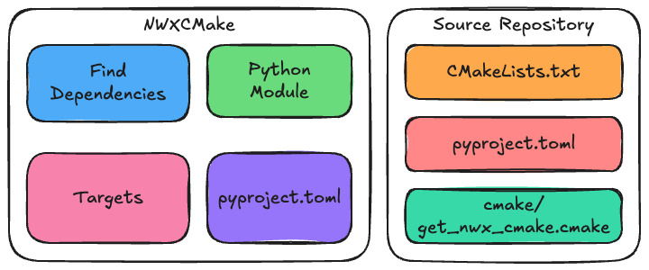
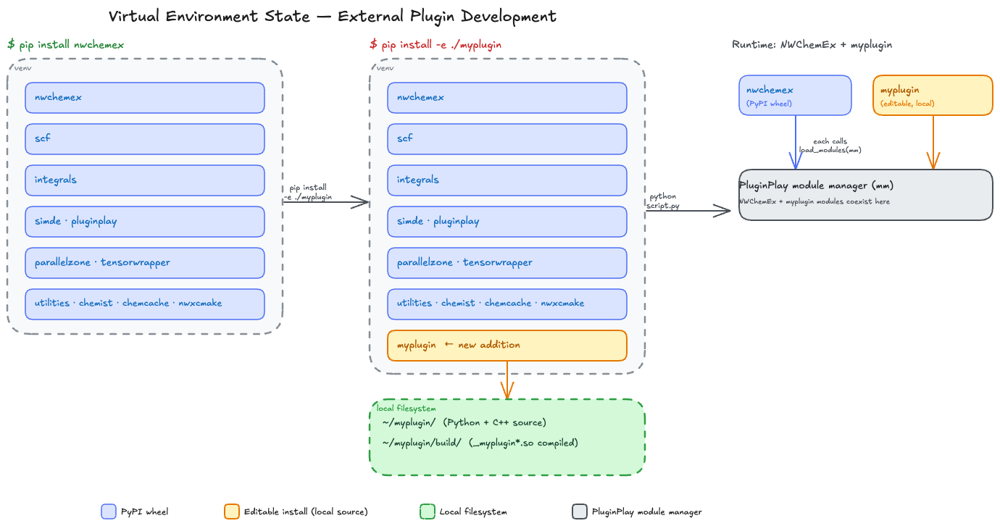
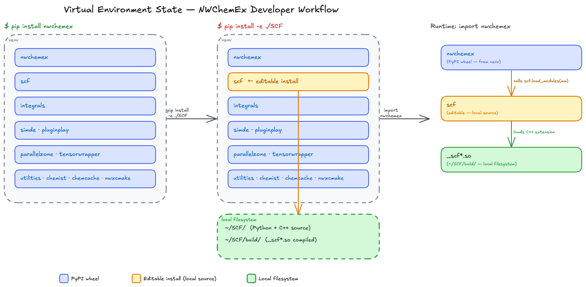

# Build System Design

This page describes the design decisions that went into the build system used
by the NWChemEx ecosystem.

## Considerations

1. Ecosystem is made up of many small stand-alone repositories.

   - Each repository should be independently buildable.
   - Since they are all part of the same ecosystem, they should follow the same 
     patterns and conventions, i.e., there will be a lot of repetition across
     repositories and we want to obey the DRY principle as much as possible.

2. In general, repositories will contains a mix of C++ and Python source.

   - C++ will be compiled into a library that can be linked directly to from
     other C++ code.
   - Python interfaces will be the preferred way for users to interact with the
     code.
   - Projects should be built in such a way that both are possible at once,
     e.g., part of the stack can link to the C++ library directly, while the
     rest imports it as a Python module.
  
3. It must be possible for development changes to take affect immediately in
   a local dev environment without needing to merge the changes into the GitHub
   main branch or publish a new version of the package to PyPI.

   - A common scenario is a plugin needs a new feature added to say SIMDE. The
     developer will then work with a local copy of SIMDE which has the new
     feature and verify that the plugin works with it. Once the feature is
     verified it will be merged into the main branch of SIMDE and a new version
     of SIMDE will be published to PyPI. The plugin can then be updated to
     depend on the new version of SIMDE and published to PyPI too. 
   - We thus are looking for something like pip's editable install feature, but
     ensuring it works for C++ and Python.

4. The ecosystem is brought together by a top-level NWChemEx package. For easy
   plugin development it should be possible to have the integration tests of a
   plugin repo depend on the existing state of the NWChemEx package, even though
   the plugin may be included in that package. This creates a dependency cycle
   that must be broken in some way.
5. It must be possible to add plugins at runtime to the result of the NWChemEx
   package without needing to rebuild it.

## Design Decisions

### C++ is built with CMake

CMake is the de facto standard for building C++ code. It is widely used in the
C++ community and is well supported by IDEs and other tools. CMake is also
highly configurable and can be used to build C++ code for a wide variety of
platforms and compilers. NWChemEx will use vanilla CMake as its C++ build 
system. This partially addresses consideration 2.

#### Previous Decisions

CMake is admittedly verbose. Previously we tried to hide that verbosity by
wrapping CMake in what we called CMaize. While CMaize provided succinct
wrappers, those wrappers came at the cost of indirection and complexity.
Our take-home message was that clean wrappers are possible, but doing so in a 
completely generic way was too much of a burden for the project.

### Project-Wide CMake Modules

Inspired by the failure of the CMaize, we have instead opted to create CMake
modules that hard-code the common build patterns we use across the NWChemEx
ecosystem in such a way that they can be reused across repositories
without the need for indirection. When possible repositories should use these
modules to reduce boilerplate code. N.b., that compared to CMaize, no attempt
is made to make these modules generic. These modules live in NWXCMake. This is 
our current solution for consideration 1.

### Python is built with pyproject.toml

Pyproject.toml is the standard for building Python code. It is widely used
in the Python community and is well supported by IDEs and other tools. 
Pyproject.toml is also highly configurable and can be used to build Python code 
for a wide variety of platforms and interpreters. NWChemEx will use 
pyproject.toml as its Python build system. This addresses the remainder of
consideration 2.

## Build Infrastructure Architecture

NWXCMake Repo key pieces:

- "Python module" and "pyproject.toml" make the NWXCMake repo pip installable. 
  This makes it easier to bootstrap the build system.
- "Find Dependencies" is a collection of CMake modules that can find and
  configure dependencies used throughout the ecosystem. There is also a driver
  that hides the details from the caller.
- "Targets" is a collection of CMake modules designed to configure targets --- 
  e.g., C++ library, and test suites -- from minimal inputs.

Key pieces in other repos:

- "cmake/get_nwx_cmake.cmake" is a boilerplate CMake module that discovers or
  obtains the CMake modules in NWXCMake.
- "CMakeLists.txt" includes some boilerplate for pulling in NWXCMake, but
  otherwise is fairly project-specific in that it establishes dependencies,
  build options, available test suites, etc.
- "pyproject.toml" similar to "CMakeLists.txt", but for Python.

Compared to having each repo implement and maintain its own build system,
this architecture is quite light. Unfortunately, the three key files that go
in each repo are still boilerplate heavy

## Understanding the Development Cycle

The above figure demonstrates how users can develop a feature in a plugin that
lives outside the NWChemEx organization (and thus not included in the NWChemEx
meta-package), but still have NWChemEx use the development version in real time.
It addresses consideration 3 for plugins outside the NWChemEx package, as
well as considerations 5.

The above figure demonstrates how the current build system addresses
considerations 3 for plugins in the NWChemEx package and  consideration 4
(which only applies to plugins in the NWChemEx package).
