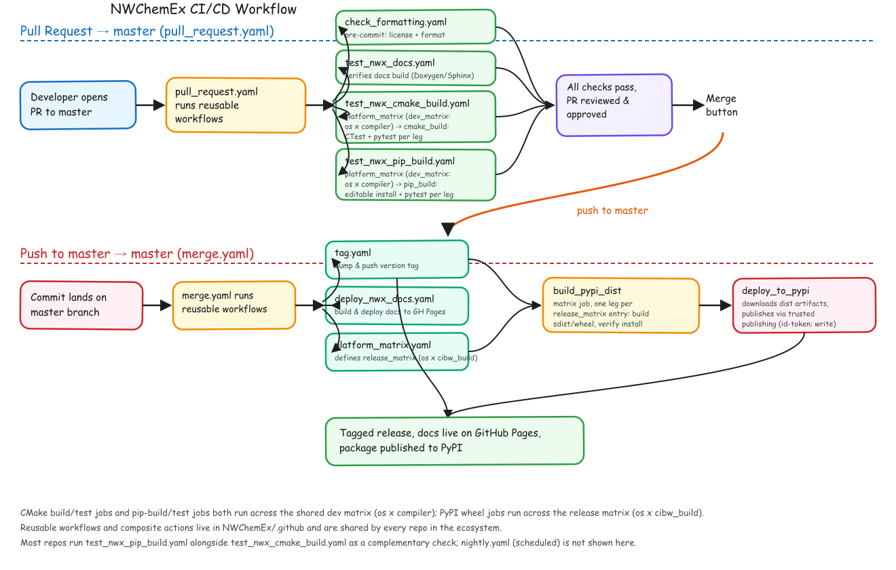

# CI/CD Overview

This page summarizes the key steps of the CI/CD workflows that run when a pull
request is opened against `master` and when changes are merged into `master`.
For a deeper dive into how these workflows are implemented, see the
[Continuous Deployment](/author/continuous_deployment/) section.

## Workflow Summary

## Pull Request Workflow (`pull_request.yaml`)

Triggered whenever a PR is opened (or updated) against `master`:

1. A developer opens a PR targeting `master`.
2. GitHub Actions runs the reusable workflows defined in `NWChemEx/.github`:
   - `check_formatting.yaml` -- runs `pre-commit` to check license headers and
     formatting.
   - `test_nwx_docs.yaml` -- verifies the repo's documentation builds
     (Doxygen and/or Sphinx).
   - `test_nwx_cmake_build.yaml` -- pulls the shared dev matrix (OS x
     compiler) from `platform_matrix.yaml`, then, for each leg, configures
     and builds the repo with CMake and runs its CTest (C++) and, optionally,
     pytest (Python) suites.
   - `test_nwx_pip_build.yaml` -- runs across the same dev matrix, but
     verifies the repo's actual `pip install` path (via `pyproject.toml`,
     e.g. scikit-build-core for the CMake-backed repos) works end-to-end,
     then runs the pytest suite against that editable install. Most repos
     with a `pyproject.toml` run this alongside `test_nwx_cmake_build.yaml`
     as a complementary check, since the two exercise different install
     paths; a pure-Python repo with no `CMakeLists.txt` passes
     `run_cmake_tests: "false"`.
3. Once all checks pass and the PR has been reviewed and approved, it is
   merged into `master`.

## Merge Workflow (`merge.yaml`)

Triggered whenever a commit lands on `master` (i.e., right after a PR merges):

1. The commit lands on `master`.
2. GitHub Actions runs the reusable workflows defined in `NWChemEx/.github`:
   - `tag.yaml` -- bumps and pushes the version tag for the new commit.
   - `deploy_nwx_docs.yaml` -- builds and publishes the repo's documentation
     to GitHub Pages.
   - `platform_matrix.yaml` -- defines the release matrix (OS x
     `cibw_build`) used for packaging.
3. `build_pypi_dist` runs as a matrix job, one leg per entry in the release
   matrix (depends on `tag-commit` and `platform_matrix`). Each leg builds a
   source distribution and/or a wheel (via `cibuildwheel` for compiled
   packages), then verifies the wheel installs cleanly, and uploads it as a
   build artifact.
4. `deploy_to_pypi` downloads the artifacts from every leg and publishes them
   using PyPI's trusted publishing (`id-token: write`, no stored API token).
5. The result is a tagged release, with documentation live on GitHub Pages
   and the package published to PyPI.

The CMake and pip build/test jobs run on bare runners using a native
(apt on Linux, Homebrew on macOS) compiler toolchain set up per matrix leg;
the docs build/deploy jobs run in a container built from
`ghcr.io/nwchemex/nwx_buildenv:latest`, which pre-installs the compilers,
math libraries, MPI, and other dependencies shared across the NWChemEx
stack. The PyPI packaging jobs also run on bare runners (plus, for compiled
packages, `cibuildwheel`'s own manylinux/macOS build containers) since they
need to produce portable wheels rather than use the ambient dev environment.

A `nightly.yaml` workflow (scheduled, not tied to PRs or merges) also exists
in each repo but is not covered here.
