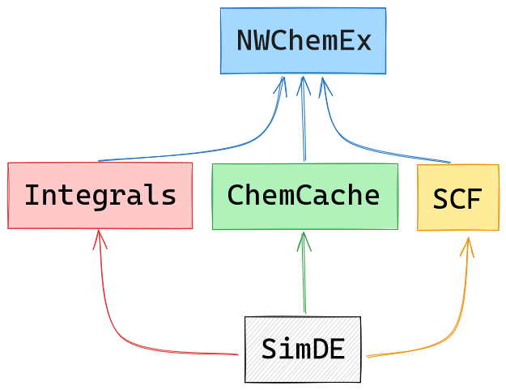
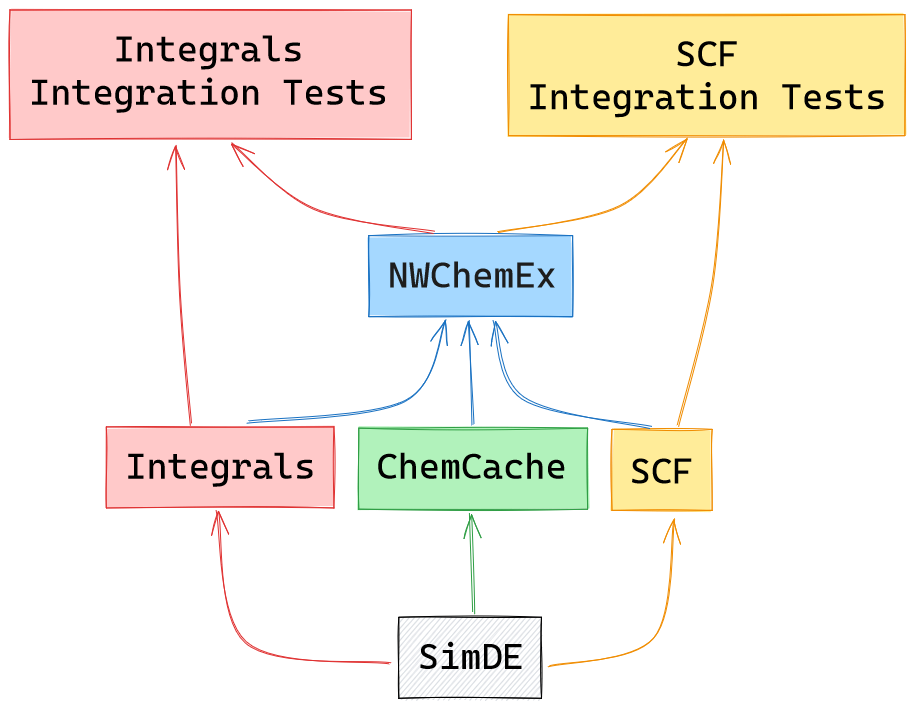

# Writing Integration Tests for NWChemEx

NWChemEx is a modular ecosystem designed with separation of concerns as a key
design point. An example of this separation can be found with the
SCF, integrals, and ChemCache libraries. These components of NWX are linked
by SimDE and are intended to be used together, but are not explicitly
required for the development of one another (see the figure below). The unit
tests for these libraries are intended to ensure basic functionality and
correctness, which can usually be accomplished with simple test data that
allow the unit tests to run quickly.



With that said, the initial development and testing of the SCF becomes very
awkward when one is unable to easily acquire real integrals for real
molecular systems. Additionally, changes to the integrals code could have
deleterious effects on the SCF code, which we would like to detect before
merging. For these (and other) reasons, it can be useful to implement
integration tests to ensure the continued interoperability of the isolated
components of the NWX stack. Because the tests are built on top of the
plugins, it is simple to include NWChemEx itself as a dependency of the
test. This way, changes at the plugin level can be screened to guarantee
that they don't break interoperability with the others.



## The Self-Override Rule

Because an integration test for a repo (call it `R`) works by depending on
NWChemEx, and NWChemEx itself depends back on `R`, it is easy to accidentally
build and test the *wrong* copy of `R` -- the one the ecosystem drags in,
rather than the working tree the test is meant to exercise. This happened in
practice: SCF's integration-testing CI job installed the whole ecosystem via
`pip install nwchemex`, which pulled in the published `nwchemex-scf`
alongside it. On macOS, no wheel exists for `nwchemex-scf`, so pip
source-built the published sdist -- which had gone stale relative to
`chemist` master and no longer compiled. The workaround was to mark the leg
`allow_macos_failure`, silencing exactly the signal integration testing
exists to produce.

The rule that prevents this, and that every mechanism on this page exists to
enforce, is one sentence:

> **An integration test for repo `R` builds `R` from the working tree and
> pulls every other ecosystem member from its released copy. `R`'s own copy
> inside the ecosystem is overridden, never installed, never fetched.**

## Where the Ecosystem Comes From

An integration test needs "the rest of NWChemEx" without recompiling it.
NWXCMake resolves each ecosystem dependency (`chemist`, `pluginplay`,
`simde`, `integrals`, `chemcache`, `nux`, `scf`, `nwchemex`, ...) with
`nwx_ecosystem_dependency()`, which tries these sources in order and stops at
the first that matches:

1. **The repo under test.** If the dependency's name matches the top-level
   project's own name (recorded in `NWX_TOP_PROJECT_NAME`), it resolves to
   the target this build already defined -- i.e. the working tree. This
   branch runs before every other one, including the installed-wheel branch
   below: if it ran later, an integration-testing build (which has the
   ecosystem's wheels installed by design) would resolve the repo under test
   to its own *published* copy and silently test the wrong code. If no
   matching target exists yet, this is a configure-time error rather than a
   silent fallback -- see "Ordering Matters" below.
2. **Already resolved.** Some earlier dependency in this same configure
   already produced a target with this name.
3. **A local source directory**, via CMake's own
   `FETCHCONTENT_SOURCE_DIR_<NAME>` -- see "Developing Against a Local
   Sibling" below.
4. **An installed wheel**, found in the active venv's site-packages. Every
   ecosystem repo publishes a wheel carrying its headers, its shared
   libraries, and a `<name>Config.cmake`, so this reuses a released build
   instead of re-cloning and recompiling the entire stack for every
   integration test. This is what makes integration testing affordable: only
   the repo under test compiles.
5. **git master**, fetched with `FetchContent` and built from source. This is
   also the fallback used when no wheel is installed at all (e.g. a plain
   `cmake -B build -DINTEGRATION_TESTING=ON` with no ecosystem installed
   first).

Setting `NWX_ECOSYSTEM_FROM_SOURCE=ON` skips branch 4 entirely, so every
ecosystem member is built from git master instead of resolved from a wheel.
Reach for this only if a released wheel turns out to be unusable for some
class of test (see "A Note on ABI" below) -- it trades the speed of the
wheels model for tip-of-tree coverage of the whole stack.

## Ordering Matters

Branch 1 above requires that the repo under test's own CMake target already
exists by the time its ecosystem dependency is resolved. Concretely: the
`get_dependencies(nwchemex)` call that pulls in the ecosystem (transitively,
through `NWChemEx`'s own `CMakeLists.txt`) must come **after** the
`nwx_library()` call that defines this project's own target. Getting this
backwards used to produce a confusing "duplicate target" error; it is now a
`FATAL_ERROR` that names the rule directly.

## Wiring It Up With CMake

The following block, modeled on SCF's own `CMakeLists.txt`, adds integration
testing to a project that already builds unit tests with
`catch2_tests_from_dir()` and `nwx_python_test()`:

```CMake
if(BUILD_TESTING)
    # ... unit test setup, including nwx_library() for this project's own
    # target, comes first ...

    if(INTEGRATION_TESTING)
        # Pulls in the ecosystem (see "Where the Ecosystem Comes From"
        # above). Must come after nwx_library() -- see "Ordering Matters".
        get_dependencies(nwchemex)

        catch2_tests_from_dir(
            "test_integration_${PROJECT_NAME}"
            "tests/cxx/integration_tests"
            ${PROJECT_NAME} ${NWX_DEP_TARGET_nwchemex}
            PRIVATE_INCLUDES "cxx/src" "cxx/src/${PROJECT_NAME}"
        )

        nwx_python_test(
            py_integration_test_${PROJECT_NAME}
            "${CMAKE_CURRENT_LIST_DIR}/tests/python/integration_tests/run_integration_tests.py"
        )
    endif()
endif()
```

`INTEGRATION_TESTING` is declared (default `OFF`) by
`set_default_nwx_options`, alongside `BUILD_TESTING` and
`BUILD_PYBIND11_BINDINGS`, so no project needs to declare it itself.

Because every ecosystem member other than the repo under test arrives as an
installed wheel, no manual `PYTHONPATH`/`ENVIRONMENT` plumbing is needed to
make `import nwchemex` (or any other sibling) work under CTest -- it's
importable from site-packages like any other installed package.
`nwx_python_test()` already prepends the repo under test's own freshly-built
extension ahead of that.

## Wiring It Up With Pip

An **editable** install (`pip install -e ".[dev]"`) sets `DEVELOPER_SETUP=ON`
via each repo's `[[tool.scikit-build.overrides]]` block, and
`set_default_nwx_options` force-enables both `BUILD_TESTING` and
`INTEGRATION_TESTING` whenever `DEVELOPER_SETUP` is on. So a developer who
wants integration tests locally needs only:

```console
pip install nwchemex --no-deps
pip install nwchemex-simde nwchemex-integrals nwchemex-chemcache nwchemex-nux \
    nwchemex-friendzone[molssi]   # every ecosystem member except this repo
pip install -e ".[dev]"
pytest -v
```

The middle step is exactly what CI's `install_nwx_ecosystem` action automates
(see below) -- it reads `nwchemex`'s own dependency metadata so the sibling
list can never drift out of sync by hand.

## Wiring It Up in CI

Both shared reusable workflows accept an `integration_testing` input:

```yaml
test_cmake_build:
    uses: NWChemEx/.github/.github/workflows/test_nwx_cmake_build.yaml@master
    with:
      run_python_tests: "true"
      python_version: "3.12"   # match the ecosystem's published wheel ABI
      integration_testing: "true"

test_pip_build:
    uses: NWChemEx/.github/.github/workflows/test_nwx_pip_build.yaml@master
    with:
      python_version: "3.12"
      integration_testing: "true"
```

Setting it installs the ecosystem (minus this repo's own published copy) via
the `install_nwx_ecosystem` composite action, then asserts that this repo's
own distribution -- if installed at all -- carries a `direct_url.json`,
i.e. came from the working tree rather than from an index. That assertion is
the safety net for the self-override rule: whatever route a future bug takes
(a version bump makes this repo newly satisfy some other sibling's
dependency, a workflow gets reordered, ...), it fails loudly instead of
silently testing the published copy.

Pin `python_version` to `3.12` (or whatever `platform_matrix.yaml`'s
`release_matrix` currently publishes wheels for) whenever
`integration_testing` is set -- under a newer ambient Python,
`install_nwx_ecosystem` falls back to slow, and possibly failing, source
builds of the siblings instead of installing their prebuilt wheels.

## Writing the Tests

Integration tests are written the same way unit tests are (see
[Writing Unit Tests](unit.md)), just with the wider ecosystem available as
submodules. A Python example, testing an SCF module against integrals
supplied by the rest of NWChemEx:

```python
import unittest

import nwchemex
from pluginplay import ModuleManager
from simde import AOEnergy, MolecularBasisSet, MoleculeFromString


class TestIntegration(unittest.TestCase):
    def setUp(self):
        self.mm = ModuleManager()
        nwchemex.load_modules(self.mm)  # also loads this repo's own modules

    def test_scf_module(self):
        key = "SCF Module"  # the module under test

        molecule_pt = MoleculeFromString()
        basis_set_pt = MolecularBasisSet()
        energy_pt = AOEnergy()

        mol = self.mm.run_as(molecule_pt, "NWX Molecules", "water")
        bs = self.mm.run_as(basis_set_pt, "sto-3g", mol)

        # Wire in a submodule supplied by another ecosystem member.
        submod_key = "A submodule of my SCF module"
        integral_key = "Some integral needed to run SCF"
        self.mm.change_submod(key, submod_key, integral_key)

        egy = self.mm.run_as(energy_pt, key, mol, bs)
        self.assertAlmostEqual(egy, -74.94208027122616, places=6)
```

The C++ counterpart follows the same shape as the C++ unit tests, but
initializes and finalizes through this project's own module (so MPI/module
state is set up once per test binary) and pulls in the ecosystem headers it
needs directly:

```c++
#include <catch2/catch_all.hpp>
#include <chemcache/chemcache.hpp>
#include <integrals/integrals.hpp>
#include <nux/nux.hpp>
#include <scf/scf.hpp>

template<typename FloatType>
pluginplay::ModuleManager load_modules() {
    pluginplay::ModuleManager mm;
    chemcache::load_modules(mm);
    integrals::load_modules(mm);
    nux::load_modules(mm);
    scf::load_modules(mm);
    // ... wire submodules as needed ...
    return mm;
}

TEST_CASE("SCFDriver") {
    auto mm = load_modules<double>();
    // ... run a module through mm, assert on the result ...
}
```

## Developing Against a Local Sibling

To work on two repos together before either has published a release that
reflects the change -- e.g. a Chemist API change that SCF's integration
tests need to exercise -- point the consuming repo's configure at the
sibling's local checkout instead of waiting on a release:

```console
cmake -S . -B build -DINTEGRATION_TESTING=ON \
    -DFETCHCONTENT_SOURCE_DIR_CHEMIST=/path/to/local/Chemist
```

This takes priority over both the installed-wheel and git-master branches
(see "Where the Ecosystem Comes From" above), so the sibling is built from
that exact checkout instead.

## A Note on ABI

Because ecosystem wheels are built by `cibuildwheel` with its own toolchain,
a C++ integration test executable compiled locally (or in CI's
gcc-14/clang-18 legs) links against libraries built with a potentially
different compiler. Python integration tests are unaffected -- each
extension module is already self-contained and ABI-bound at wheel-build
time -- but a C++ integration test that fails to link or crashes at runtime
against wheel-provided libraries, where the same test passes with
`NWX_ECOSYSTEM_FROM_SOURCE=ON`, is worth suspecting as an ABI mismatch rather
than a real regression.
