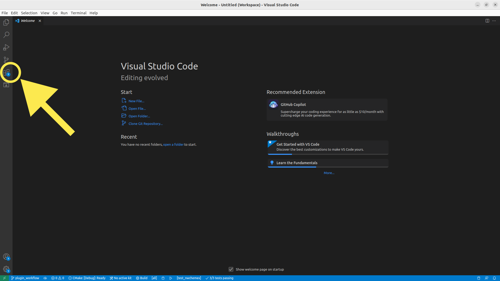
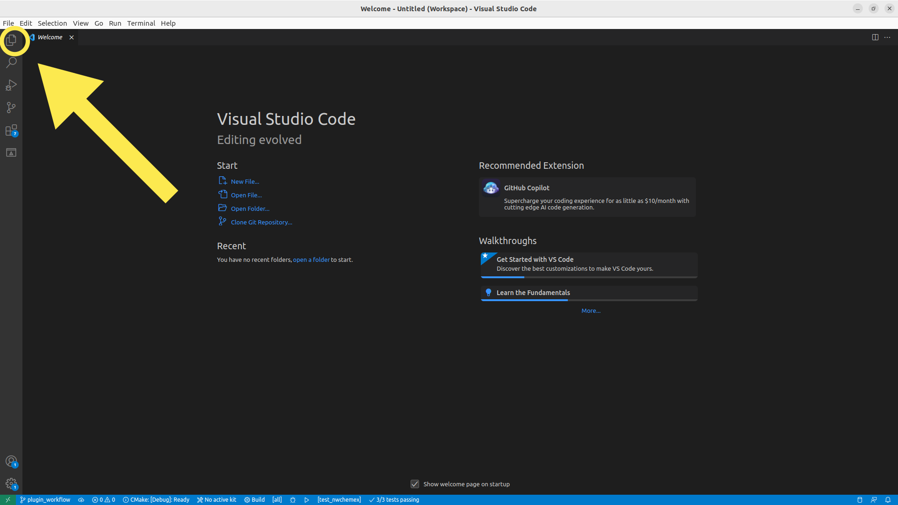
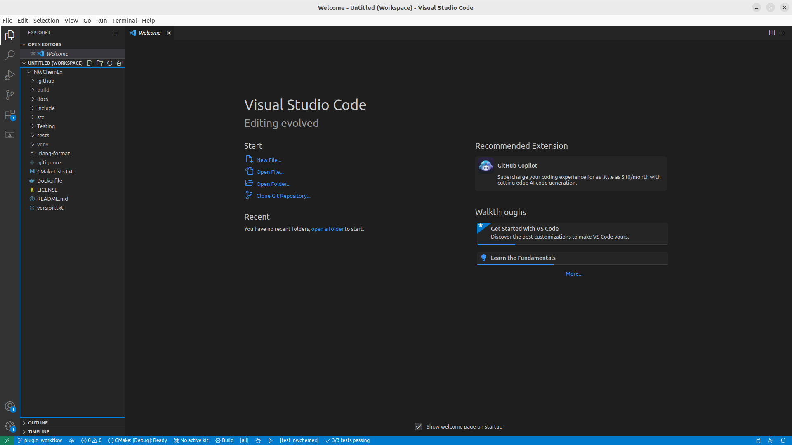

This page focuses on how to initially setup VSCode, specifically from the
perspective of developing a module/plugin for NWChemEx on a Linux machine.

## Adding Extensions

By default VSCode is pretty bare bones. Additional features
are added/enabled by installing extensions. When you load up source code VSCode
will inspect it and automatically recommend you install the corresponding
extenstion (if it's not installed already). For developing NWX we recommend you
minimally install:

#. `ms-vscode.cpptools`
#. `ms-vscode.cmake-tools`
#. `ms-python.python`

To install an extension click on the extensions view (see
`fig_click_extensions`) and search for the identifiers given in the
above list.

## Creating a Workspace

When you first start up VSCode you will have an empty workspace. We need to add
content to that workspace.

To do this navigate to `files->add folder to workspace` as shown in
`fig_add_folder_to_workspace`. This will bring up a file explorer,
which you should then use to navigate to the root directory of the repository
you want to add.

To see the repositories you've added so far click on the explorer icon shown
in `fig_click_explorer`.

This will open the explorer pane and VSCode will look something like shown
in `fig_explorer_open`. For developing an NWChemEx module/plugin you
will minimally want to have the repositories for NWChemEx and your plugin in
your workspace. Repeat adding folders for each other repository you want to
have in your workspace.

> **Note:**
> AFAIK adding each repo individually in this manner is the only way for the
> CMake extension to properly register the root CMakeLists.txt for each repo.
